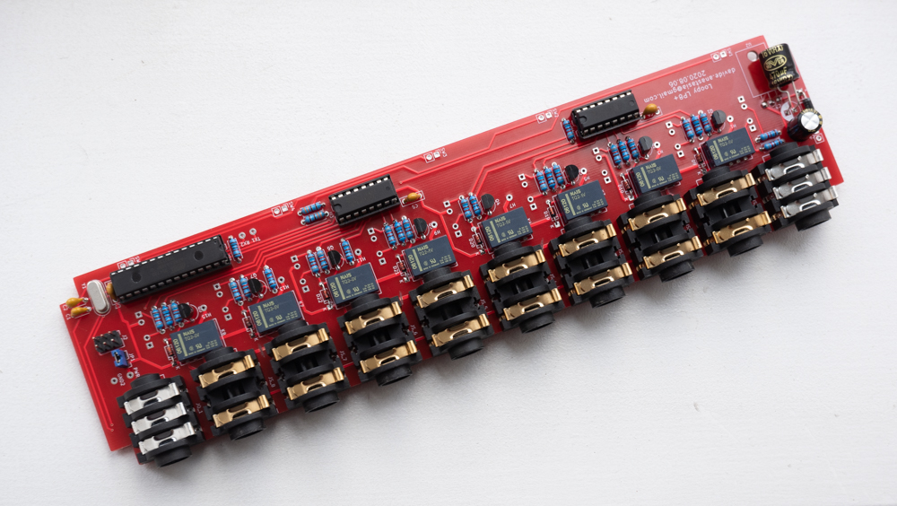

#  Loopy

Loopy (LP8+) is a DIY 8 loop programmable guitar pedal switcher with support for MIDI commands.

Loopy is designed around easy-to-find components:
 - an atmega328(p) micro controller
 - 2 74HC595 registers
 - 8 relays
 - several LEDS
 - several audio jacks

This page is a collection of documents that can help you build your own looper.

##  FAQ

###  How does it work?

Have a look at the [Manual](./manual.md) for more info.

###  Can you guide me through the build?

Please refer to the [How To Build Loopy](./howto.md) page.

###  Where can I find a PCB?

Please contact me if you need a PCB: I will try to have spares available as long as there is demand for it.

###  Why no display?

Rectangular holes (of good quality) are generally quite hard to make unless you have specialised tools, so I have put more effort on dislaying the status using LEDs, which only require round holes.

###  Does the signal go through a buffer?

No. Loopy doesn't contain any signal buffer: this gives the final user the flexibility to choose whether to have or not a buffer.

###  Is this an Arduino project?

No. While the micro controller used in this project is the same of the Arduino UNO, nothing of the Arduino platform is used: no bootloader, no USB port, no libraries. In fact, all the code is written from scratch in C++.

###  Can I build this project and sell it?

No. However, I could be interested in discussing a partnership. Please get in touch.

###  Can I have the source code of the firmware?

No. At the moment, I have decided to keep the source code private.