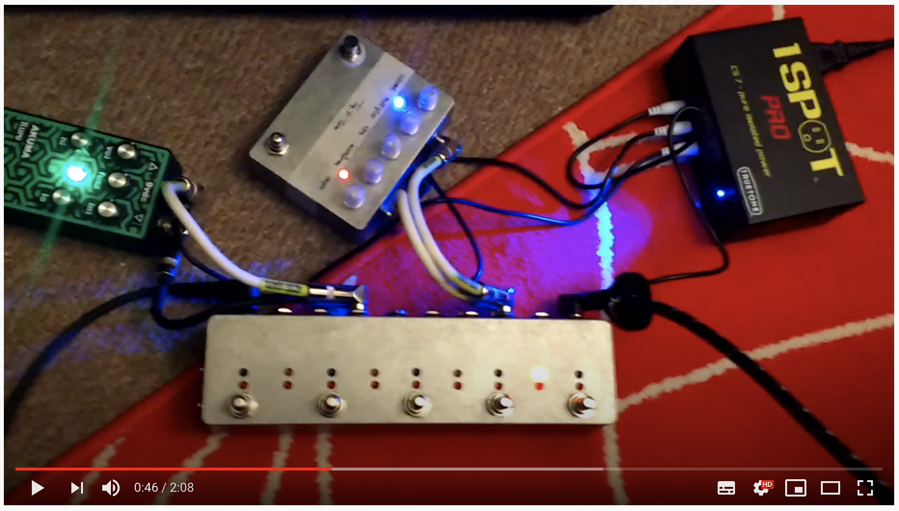

# Loopy LP8+ Manual

The interface is built around 5 footswitches and 18 LED.

LED are divided into three groups:
- 2 LED on the right side to indicate the status
- 8 LED of the bottom strip to indicate whether a loop is engaged or not
- 8 LED of the top strip to indicate bank & preset

Loopy can be used in two modes:
- play
- preset

A very short video can be found below:

## Play Mode

In play mode, every loop can be directly accessed either pushing one footswitch, or two footswitch at the same time. The entire looper can be bypassed using the `Bypass` footswitch (`FS1`):

## Preset Mode

To enter (and exit) the preset mode, hold the `FS1` for 2 seconds. 

In preset mode, the first LED of the top strip will be ON to indicate the new mode.

When entering the preset mode LED on the first strip will start blinking to indicate the current page and preset. Loops will *not* immediately change their configuration when entering the preset mode to give the user the chance to select the right preset before before changing how the sound of the instrument is modified. 

The same behaviour is applied when moving across pages: no config is changed until a preset is confirmed.

Once a preset button is pressed, LED on the first strip will stop blinking and the LED on the second strip (and their associated loops) will switch on or off as programmed.

## MIDI

### Midi Out

`MIDI Out` port is enabled when the looper is in `preset mode`. Program Change are sent to **Channel 1** using the table below:

| Page | Preset | Program Change |
| --- | --- | --- |
| 1 | 1 | 1 |
| 1 | 2 | 2 |
| 1 | 3 | 3 |
| 1 | 4 | 4 |
| 2 | 1 | 5 |
| 2 | 2 | 6 |
| 2 | 3 | 7 |
| 2 | 4 | 8 |
| 3 | 1 | 9 |
| 3 | 2 | 10 |
| 3 | 3 | 11 |
| 3 | 4 | 12 |
| 4 | 1 | 13 |
| 4 | 2 | 14 |
| 4 | 3 | 15 |
| 4 | 4 | 16 |

It is currently not possible to change the Channel without reprogramming the uC.

### MIDI Thru

Any data received in the `MIDI in` port is forwarded to the `MIDI out`, regardless of the operational mode of the looper.

### MIDI In

`MIDI In` port accepts Program Change (PC) commands on Channel 1. Loopy contains a table of 128 memory locations that can be associated to the 128 PC commands.

To **store** a new preset, in `play mode`, hold for 2 seconds `FS2` and `FS4`.

Once the LED starts blinking, the looper will be waiting for a MIDI Program Change (PC) command. 

All the footswitch at this stage are still active to change whether a loop is active or not

Once a PC is received, Loopy will store in the associated PC memory location the combination of active loops. 

If you want to exit the `MIDI Listen Mode`, hold the FS1 (Bypass) pressed for 2 seconds.

To **recall** a preset, send a PC command to Loopy when in `play mode`: configuration saved will be recalled and loops will engage/disengaged immediately. 
